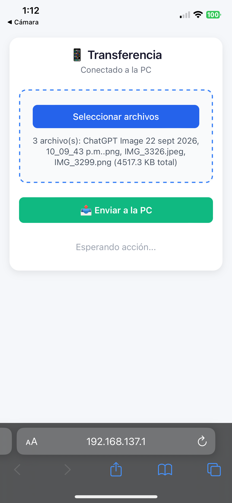
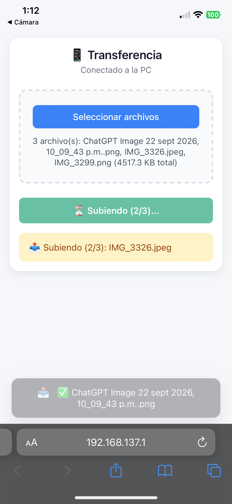
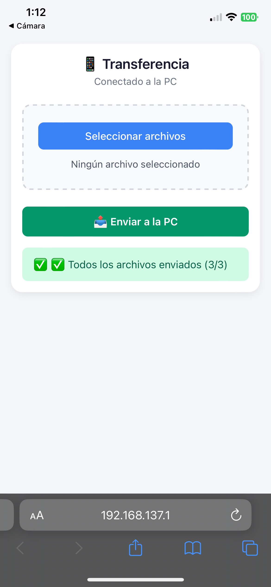
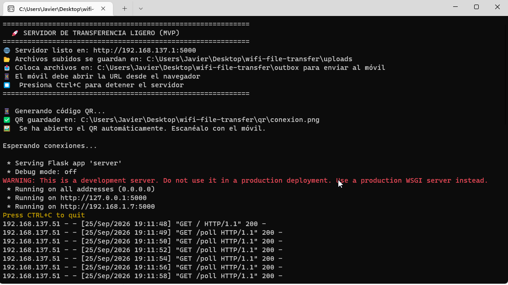

# WiFi File Transfer

Un servidor Flask ligero que permite transferir archivos entre una PC y dispositivos móviles a través de una red WiFi local — sin internet, sin cable USB.

[](https://opensource.org/licenses/MIT)
[](https://www.python.org/downloads/)
[](#tests)

> 🇪🇸 Español · 🇬🇧 [English version](README.md)

---

## 📖 Descripción general

**WiFi File Transfer** resuelve un problema simple pero molesto: mover archivos entre una PC y un teléfono cuando no hay internet, no hay cable USB y no hay servicio en la nube disponible.

Levanta un pequeño servidor HTTP en la PC. El teléfono se conecta al Hotspot de la PC (o a la misma red WiFi), escanea un código QR y puede enviar o recibir archivos inmediatamente desde el navegador. Sin aplicaciones que instalar, sin cuentas, sin configuración.

Originalmente creado para un entorno de trabajo donde los métodos tradicionales de transferencia estaban bloqueados o eran poco prácticos.

---

## 📸 Capturas

| Listo para enviar | Subiendo | Completado |
|---|---|---|
|  |  |  |

| Código QR generado | Consola del servidor |
|---|---|
|  |  |

*La consola del servidor mostrando la IP detectada, el código QR generado y la actividad de polling del teléfono.*

---

## ✨ Características

- 📷 **Generación automática de QR** — Al arrancar, el servidor genera un código QR con la URL de conexión y lo abre automáticamente. Solo hay que escanearlo con el teléfono.
- 📤 **Móvil → PC** — Sube uno o varios archivos desde el navegador del teléfono directamente a la PC.
- 📥 **PC → Móvil** — Deposita archivos en la carpeta `outbox/` y se envían al teléfono automáticamente mediante polling.
- 📱 **Interfaz mobile-first** — Responsive, sin frameworks, sin CDNs externos. Carga al instante.
- 🌐 **Detección automática de IP** — Detecta la IP del Hotspot de Windows al arrancar y tiene fallback si falla.
- 🧪 **20 tests unitarios pasando** — La lógica principal está testeada (detección de IP, monitor de outbox, endpoint de subida, arranque).
- 📦 **Ejecutable autónomo** — Descarga `wifi-file-transfer.exe` desde [Releases](../../releases) — no requiere instalar Python.

---

## 🛠️ Stack Tecnológico

| Capa | Tecnología |
|---|---|
| Backend | Python 3.10+, Flask |
| Frontend | HTML5, CSS3, JavaScript Vanilla |
| Generación de QR | `qrcode` + `Pillow` |
| Testing | `unittest` |
| Empaquetado | PyInstaller |

Sin frameworks de frontend, sin paso de compilación, sin CDNs externos. Toda la aplicación corre desde un único archivo Python más una plantilla HTML.

---

## 🚀 Cómo ejecutarlo

> ⚠️ **Importante — el orden importa:**
> Activa el Hotspot de Windows **antes** de arrancar el servidor. El servidor detecta la IP del Hotspot al iniciar. Si lo ejecutas antes de que el Hotspot esté activo, tomará la IP equivocada y el código QR no funcionará.

### Opción 1 — Ejecutable autónomo (recomendado para usuarios finales)

1. **Activa el Hotspot de Windows** (Configuración → Red e Internet → Zona con cobertura móvil).
2. Descarga `wifi-file-transfer.exe` desde la página de [Releases](../../releases).
3. Haz doble clic. Se abrirá un código QR automáticamente y la consola mostrará la URL del servidor, por ejemplo `http://192.168.1.50:5000`.
4. Conecta el teléfono al Hotspot de la PC (o a la misma red WiFi).
5. **Escanea el código QR** — o abre manualmente la URL que aparece en la consola, usando la IP impresa en pantalla y el puerto `5000`. Ejemplo: `http://192.168.1.50:5000`.

### Opción 2 — Desde el código fuente (para desarrolladores)

```bash
git clone https://github.com/JavierVizGarriDev/wifi-file-transfer.git
cd wifi-file-transfer
python -m venv venv
venv\Scripts\activate          # Windows
pip install -r requirements.txt
python server.py
```

Luego sigue los pasos 4 y 5 de arriba.

---

## 📂 Estructura del proyecto

```
wifi-file-transfer/
├── server.py                # Backend Flask + generación de QR + detección de IP
├── test_server.py           # Tests unitarios (20 pasando)
├── server.spec              # Configuración de compilación con PyInstaller
├── requirements.txt         # Dependencias de producción
├── requirements-dev.txt     # Dependencias de desarrollo (PyInstaller)
├── LICENSE                  # Licencia MIT
├── templates/
│   └── index.html           # Frontend mobile-first
├── uploads/                 # Archivos recibidos desde el móvil (gitignored)
├── outbox/                  # Archivos para enviar al móvil (gitignored)
└── qr/                      # Códigos QR generados (gitignored)
```

---

## 🧪 Tests

Ejecuta la suite de tests con:

```bash
python -m unittest test_server.py
```

Estado actual: **20 tests pasando**.

Cubre:
- Detección de IP (IP típica del Hotspot, IPs privadas alternativas, manejo de errores, problemas de encoding)
- Monitor de outbox (vacío, un archivo, múltiples archivos, omisión de carpetas)
- Endpoint de subida (`/upload`) — éxito, nombre vacío, renombrado por colisión
- Lógica de arranque (`main()`) — creación de carpetas, manejo de errores, parámetros de `app.run`

> **Nota sobre deuda técnica**: la suite de tests aún no cubre `/poll`, `/download_push` ni `generate_qr()`. Está planeado para una iteración futura.

---

## 🗺️ Hoja de ruta

- [ ] Añadir tests para `/poll`, `/download_push` y `generate_qr()`
- [ ] Protección opcional con contraseña para el servidor
- [ ] Barra de progreso para subidas de archivos grandes
- [ ] Detección de IP multiplataforma (Linux / macOS)
- [ ] App nativa para Android (en progreso en una rama separada)

---

## 🤝 Contribuciones

Este es principalmente un proyecto de aprendizaje personal, pero las sugerencias y el feedback son bienvenidos. Puedes abrir un issue o enviar un pull request.

---

## 📄 Licencia

Este proyecto está bajo la Licencia MIT — consulta el archivo [LICENSE](LICENSE) para más detalles.

---

## 👤 Autor

**Javier A. Vizcaino Garriga**
- GitHub: [@JavierVizGarriDev](https://github.com/JavierVizGarriDev)
- Email: javieralejandrovizcainogarriga@gmail.com

---

<p align="center">
  <i>Construido para resolver un problema real, un commit a la vez.</i>
</p>